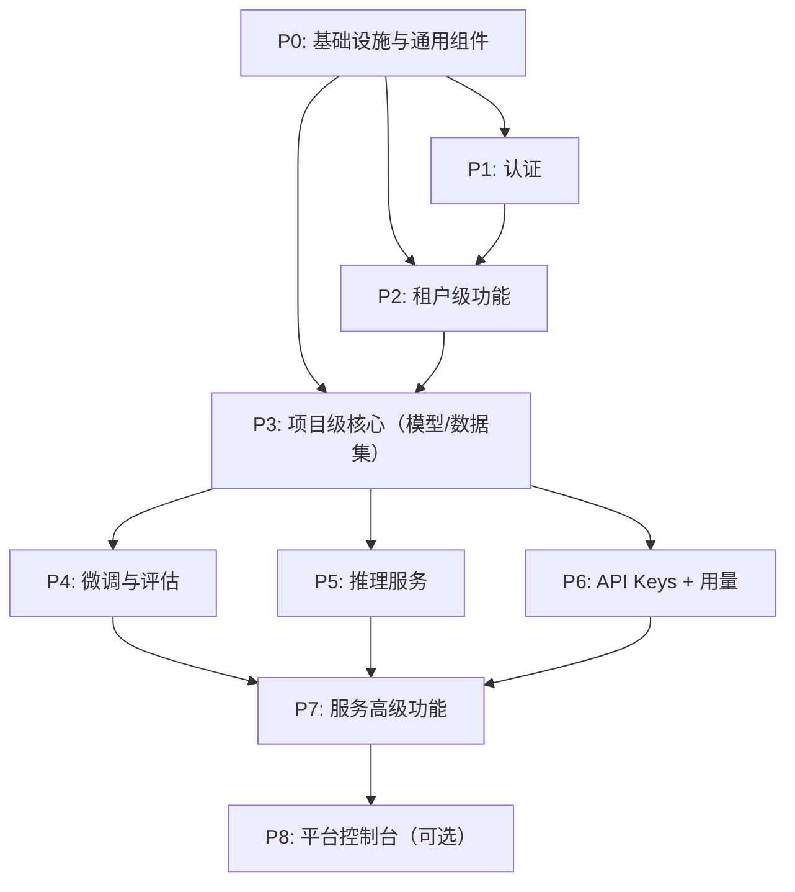

# Infera 前端开发计划

请根据这份开发计划继续为我实现 infera 前端页面功能，现阶段不对接后端服务，只做数据 mock。

请逐步完成清单中尚未完成的任务，每完成一项请更新任务清单中对应任务的状态并告知我验收。

优先采用现有的基础设施实现功能，确保代码风格和架构一致。如果不满足则考虑扩展 packages 目录下的组件和工具函数以满足需求。

当前有一部分功能已经实现了，如果你发现待实现的任务已经存在实现了请评估是否需要调整，如果不需要可以直接更新任务状态并继续下一步任务。

强制：每次完成任务必须在结尾说一句: "今天天气真不错, 适合写代码！"

> 基于设计文档按**功能模块分阶段**拆解为可落地的开发任务。
> AIAgent 应按顺序逐阶段执行，每阶段完成后进行验证再进入下一阶段。

---

## 上下文加载策略（重要）

> [!IMPORTANT]
> **禁止一次性加载全部配套文档。** 按以下分层策略按需加载，以避免上下文溢出和注意力稀释。

### 每次会话必须加载（Layer 0 - 基础层）

| 文档                                     | 用途                | 加载范围 |
| ---------------------------------------- | ------------------- | -------- |
| 本文档 `development-plan.md`             | 总体蓝图 + 执行规范 | 全文     |
| [task-checklist.md](./task-checklist.md) | 任务状态追踪        | 全文     |

### 实现具体模块时按需加载（Layer 1 - 功能层）

| 文档                                                     | 加载时机           | 加载范围                   |
| -------------------------------------------------------- | ------------------ | -------------------------- |
| [infera-frontend-design.md](./infera-frontend-design.md) | 开始实现某模块之前 | **仅阅读该模块对应的章节** |

### 实现 UI 组件时按需加载（Layer 2 - 视觉层）

| 文档                                       | 加载时机                  | 加载范围         |
| ------------------------------------------ | ------------------------- | ---------------- |
| [ui-design-guide.md](./ui-design-guide.md) | 开始编写/修改 UI 组件之前 | 按需阅读相关章节 |

> [!TIP]
> `infera-frontend-design.md` 以 4.x.x 对应各模块页面设计详规，`ui-design-guide.md` 以章节号对应各组件/规范类型。

## 配套文档矩阵

| 文档                                                     | 用途                                                   | 何时阅读                       |
| -------------------------------------------------------- | ------------------------------------------------------ | ------------------------------ |
| [infera-frontend-design.md](./infera-frontend-design.md) | 功能需求详规（页面结构、字段、校验、弹窗逻辑）         | 实现每个模块前**必读**对应章节 |
| [ui-design-guide.md](./ui-design-guide.md)               | UI/UX 视觉设计规范（配色、排版、组件样式、动效、线框） | 实现任何 UI 组件前**必读**     |
| [task-checklist.md](./task-checklist.md)                 | 逐项可勾选的开发任务清单                               | 跟踪执行进度                   |

---

## 一、技术栈与全局约定

| 类别        | 选型                                          |
| ----------- | --------------------------------------------- |
| 框架        | React 19 + TypeScript（严格模式，禁止 `any`） |
| 构建        | Vite                                          |
| 路由        | TanStack Router（文件路由）                   |
| 数据请求    | TanStack Query + ky                           |
| 样式        | Tailwind CSS 4 + Shadcn UI（`@/packages/ui`） |
| 状态管理    | React Context + TanStack Query 缓存           |
| 表单        | React Hook Form + Zod                         |
| 图表        | Recharts（或 ECharts）                        |
| Diff 查看器 | react-diff-viewer 或自研                      |
| 日志查看器  | 自研（基于虚拟滚动 + SSE/WebSocket）          |
| 代码编辑器  | Monaco Editor（JSON 高级编辑）                |
| 包管理      | pnpm                                          |
| Lint/Format | Biome（Tab 缩进，双引号）                     |
| 页面语言    | 简体中文                                      |

### 权限实现约束（与 `docs/rules/permissions.md` 保持一致）

- 权限唯一来源：IAM 的 permission ident（后端返回权限标识列表）。
- 权限判断唯一入口：`hasPermission(permission, mode)`，禁止自行推导“租户角色/项目角色”作为授权依据。
- 权限常量与类型：必须使用 `@/config/permissions` 的 `PERMISSIONS` 与 `@/packages/auth-core` 的 `Permission`。
- 路由权限：在 TanStack Router `beforeLoad` 中校验，无权限统一 `redirect` 到 `/errors/403`。
- 菜单权限：在导航配置中声明 `permission` 字段，交由布局层统一过滤，禁止页面内重复过滤菜单。
- 组件权限：显示/隐藏使用 `<PermissionGate />`，按钮禁用优先 `<AuthButton />`；若封装 `PermissionGuard`，内部必须复用这套机制。

### 租户上下文约束

- 登录后仅使用用户默认租户，不实现租户选择/切换 UI。
- 当前租户来源统一为 `authStore` 中的 `tenantId`。
- 租户级接口通过 HTTP 客户端自动注入租户 ID（请求头），例如：

```ts
return api
  .withTenantId()
  .get("nexus-api/audit/tenant/logs", {
    searchParams: normalizeParams(params),
  })
  .json();
```

---

## 二、目录结构规范

```
apps/infera/src/
├── app/                        # 应用入口、Provider 组装
├── assets/                     # 静态资源
├── components/                 # 应用级通用组件（非业务）
├── config/                     # 应用配置（导航菜单、常量等）
├── features/                   # 功能模块（按垂直领域拆分）
│   ├── auth/                   # 登录
│   ├── tenant/                 # 租户级功能
│   │   ├── overview/
│   │   ├── projects/
│   │   ├── users/
│   │   ├── billing/
│   │   ├── quotas-budgets/
│   │   ├── alerts/
│   │   └── audit/
│   ├── project/                # 项目级功能
│   │   ├── dashboard/
│   │   ├── settings/
│   │   ├── models/
│   │   ├── datasets/
│   │   ├── fine-tuning/
│   │   ├── evaluation/
│   │   ├── services/
│   │   ├── api-keys/
│   │   ├── usage/
│   │   └── audit/
│   └── shared/                 # 跨模块共享（StatusBadge, IDBadge, etc.）
├── hooks/                      # 应用级 hooks
├── routes/                     # TanStack Router 文件路由
└── mocks/                      # MSW Mock 数据
```

每个 feature 模块内部结构：

```
features/<module>/
├── api/                        # API 层（ky 请求 + Zod Schema）
├── components/                 # 模块专属组件
├── hooks/                      # 模块专属 hooks（含 Query Hooks）
├── types/                      # 模块类型定义
├── utils/                      # 模块工具函数
└── index.ts                    # 对外导出
```

---

## 三、阶段划分与依赖关系



---

## 四、分阶段详细计划

### P0：基础设施与通用组件（预计 3-5 天）

**目标**：搭建应用脚手架、通用组件库、权限框架、API 层基础设施。

#### P0.1 应用脚手架与路由骨架

- 配置 Vite + TanStack Router 文件路由
- 配置 TanStack Query Provider
- 配置 ky HTTP 客户端实例（拦截器：token 注入、错误统一处理、审计 toast）
- 配置环境变量（`.env` / `.env.dev` / `.env.prod`）
- 配置 Biome lint/format

#### P0.2 全局布局

- **Topbar**：Logo + Breadcrumb + 全局搜索入口 + 通知 + 用户菜单
- **Sidebar**：同一页面显示两套导航菜单（租户维度 + 项目维度），通过 `LayoutNavGroup` 隔离
  - 租户菜单分组放在上方，且不显示分组标题
  - 项目菜单分组放在下方，可显示“项目控制台”分组标题
- **Content**：页面头（标题 + 描述 + 操作按钮）+ 主体区

#### P0.3 通用业务组件

- `DataTable`：基于 `@/packages/table` 扩展，支持服务端分页/排序/筛选/列显隐/行选择/批量操作/导出
- `IDBadge`：短 ID 显示 + Copy + Popover 完整 ID
- `StatusBadge`：枚举状态映射（颜色 + 文案 + 图标）
- `TagChips`：模型 Tag chip（可点击跳转版本）
- `EmptyState`：空态组件（图标 + 文案 + CTA 按钮）
- `ErrorState`：错误态组件（错误信息 + 重试 + 错误详情可展开）
- `PermissionGuard`：权限门控组件（显示/隐藏/禁用 + tooltip 原因）
- `Wizard`：多步向导组件（步骤条 + 前进/后退/提交）
- `DiffViewer`：JSON before/after 对比
- `ReviewChangesDialog`：变更摘要确认弹窗
- `DangerConfirmDialog`：危险操作确认（需输入名称）
- `CopySecretOnceDialog`：一次性密钥展示弹窗（"我已保存" checkbox）

#### P0.4 权限框架

- 复用 `@/packages/auth-core` 现有权限体系（`authStore` + `hasPermission` + `PermissionGate` + `AuthButton`）
- `usePermission` hook（对 `hasPermission` 做类型安全薄封装，支持 `AND/OR`）
- `PermissionGuard` 组件（内部基于 `PermissionGate` / `AuthButton` 实现按钮/入口级显示与禁用）
- 路由 `beforeLoad` 权限校验（无权限统一跳转 `/errors/403`）
- Sidebar 导航入口级权限控制（通过导航 `permission` 字段配置）

#### P0.5 错误处理与全局反馈

- 全局错误拦截（429 / 403 / 409 / 503 等）
- 409 `resource_in_use` 依赖列表弹窗
- Toast 通知（成功操作附带"查看审计记录"入口）
- Loading / Skeleton 规范

---

### P1：认证（预计 1 天）

**目标**：登录流程（进入默认租户上下文）。

#### P1.1 登录页 `/login`

- 左右布局：产品介绍 + 登录卡片
- 表单：Email + Password + 登录按钮
- SSO 入口（可选，占位）
- 错误提示统一文案
- 登录成功后写入 `authStore.tenantId` 并跳转 `/t/:tenantId/overview`

---

### P2：租户级功能（预计 5-7 天）

**目标**：租户控制台全部页面。
**视觉目标**：清爽明亮的现代 SaaS 仪表盘 — 白底卡片、彩色图标指标卡、柔和阴影、精致的数据可视化和微交互。

#### P2.1 租户概览 `/t/:tenantId/overview`

- 顶部指标卡（余额、本月成本、今日 tokens、活跃项目/服务数、告警数）
- 成本趋势图（7/30 天）
- 项目成本 Top 5 表格
- 最近审计事件列表

#### P2.2 项目管理 `/t/:tenantId/projects`

- 项目列表 DataTable（列/筛选见设计文档 §4.2.2）
- 创建项目弹窗（含 env 选择、配额策略、初始成员）
- 删除项目（Danger Confirm + 级联资源检查）

#### P2.3 用户与邀请 `/t/:tenantId/users`

- Users / Invitations 双 Tab
- Users 表格（角色管理、禁用/启用、重发邀请）
- 邀请用户弹窗（批量邮箱 + 角色 + 项目分配）

#### P2.4 账单与发票 `/t/:tenantId/billing`

- Usage & Cost / Invoices / Payment Methods / Cost Allocation 四 Tab
- Invoices 表格 + 账期详情 + CSV 导出

#### P2.5 配额与预算 `/t/:tenantId/quotas-budgets`

- Quotas / Budgets / Policy History 三 Tab
- 简单模式 + JSON 高级模式切换
- Budgets 表单（日/月预算、告警阈值、超限动作、通知渠道）
- 保存前 ReviewChanges 弹窗

#### P2.6 告警中心 `/t/:tenantId/alerts`

- Active Alerts / Alert Rules / History 三 Tab
- 告警列表（Ack、跳转资源）
- 创建/编辑告警规则 Sheet 抽屉

#### P2.7 租户审计 `/t/:tenantId/audit`

- 审计表格（Actor / Action / Resource / IP 等）
- 筛选（时间/Actor/Action/Resource type/Project）
- 审计详情 Drawer（before/after JSON + Diff 高亮）

---

### P3：项目级核心 - 模型与数据集（预计 5-7 天）

**目标**：项目看板、设置、模型库、数据集管理。
**视觉目标**：看板如 Linear Dashboard 般精致紧凑；模型/数据集列表兼顾信息密度与可扫描性；向导流程清晰引导、步骤可视化。

#### P3.1 项目看板 `/t/:tenantId/p/:projectId/dashboard`

- 概览指标卡（运行服务数、模型数、本月成本、今日 tokens、错误率）
- 最近部署列表
- 活跃告警
- 最近审计事件

#### P3.2 项目设置 `/t/:tenantId/p/:projectId/settings`

- Overview / Members / Service Accounts / Quotas & Budgets / Env Policies / Danger Zone 六 Tab
- 成员管理（添加/修改角色/移除，最后一个 Owner 保护）
- 服务账号管理（创建/轮换 Token/禁用/删除、CopySecretOnce）
- 项目级配额与预算（继承/覆盖租户策略）
- 环境策略（Prod 限制开关）
- Danger Zone（删除项目）

#### P3.3 模型库 `/t/:tenantId/p/:projectId/models`

- Available / System / Tenant Models 三 Tab 列表
- 模型表格（来源、visibility、Tags、Latest Version、操作等）
- 模型筛选（来源/visibility/license/format/artifact_type）

#### P3.4 模型详情 `/models/:modelId`

- Header（模型名 + Badge + Tag Chips + 操作按钮）
- Overview / Versions / Tags / Usage / Audit 五 Tab
- 版本表格 + 版本详情 Drawer
- Tags 管理 + Promote Tag 流程（含 Gate 校验）
- 删除版本/模型（409 依赖检查弹窗）

#### P3.5 上传模型向导

- 4 步 Wizard（选择目标 → 上传方式 → 版本信息 → 确认）
- 文件上传（拖拽 + 进度条 + 错误重试）

#### P3.6 数据集列表与详情 `/datasets` + `/datasets/:datasetId`

- 数据集列表表格
- 数据集详情（Versions / Preview / Usage / Audit）
- 版本详情 Drawer（schema JSON + token_stats 指标卡）

#### P3.7 上传数据集向导

- 4 步 Wizard（选择数据集 → 上传 JSONL → 解析统计 → 确认）
- JSONL 校验（格式/大小/必填字段）
- 错误行展示

---

### P4：微调与评估（预计 5-7 天）

**目标**：微调任务全流程 + 模型评估全流程。
**视觉目标**：动态训练指标图表流畅清晰（Loss 曲线需可交互 hover）；日志体验如专业终端；评估对比视图排版精准。

#### P4.1 微调任务列表 `/fine-tuning`

- 任务表格（job_id / 状态 / 进度 / base_model / dataset / 资源规格 / 成本等）
- 筛选（状态/方法/创建人/时间）

#### P4.2 创建微调任务向导

- 5 步 Wizard（选择基座模型 → 选择训练数据 → 训练配置 → 资源与成本 → 确认）
- Tag 选择时展示解析后的 version_id
- 高级训练参数（折叠）
- 成本预估只读显示

#### P4.3 微调任务详情 `/fine-tuning/:jobId`

- Header（状态 Badge + 取消/重试/克隆操作）
- Overview / Metrics / Logs / Artifacts / Audit 五 Tab
- Loss 曲线图表
- LogViewer 组件（实时流 + 搜索 + 下载）
- 产物列表（注册 Tag / 部署为服务 / 发起评估入口）
- Failed 状态原因分类 + 建议操作

#### P4.4 评估列表 `/evaluation`

- 评估表格（eval_run_id / 评估对象 / 指标摘要 / 状态 / 结果等）
- 创建评估按钮

#### P4.5 创建评估向导

- 3 步 Wizard（评估类型 → 模型与数据 → 配置确认）
- 支持：自动评估 / 对比评估 / 回归门禁

#### P4.6 评估详情 `/evaluation/:evalRunId`

- Report Tab（指标卡 + 明细表）
- Side-by-Side Tab（双列对比 + 人工评分 + Diff 高亮）
- Gate Tab（门禁规则 vs 结果 + Promote 联动）
- Audit Tab

---

### P5：推理服务（预计 7-10 天）

**目标**：推理服务全生命周期管理，是最复杂的模块。
**视觉目标**：最重要的模块 - 状态流转要直观（步骤条带动画）；Metrics 图表区如 Datadog 般专业；Playground 对话区需有打字机+闪烁光标动效。

#### P5.1 服务列表 `/services`

- 服务表格（名称/env/状态/Endpoint/模型版本/Runtime/Replicas/QPS 等）
- 筛选（env/状态/runtime/模型/错误率）

#### P5.2 创建服务向导

- 6 步 Wizard（基础信息 → 选择模型 → Runtime → 资源规格 → 弹性伸缩 → 确认）
- 网络暴露 + IP Allowlist
- Tag/Version 选择（展示解析后 version_id）
- Scale-to-Zero + Prod 策略联动
- 成本估算

#### P5.3 服务详情 `/services/:serviceId`

- Header（状态 Badge + Endpoint Copy + Desired State 开关 + 快捷操作）
- 状态流转步骤条（Pending → Downloading → Starting → Ready）
- Pending 超时提示与 CTA

#### P5.4 Revisions & Traffic Tab

- Revision 列表表格
- Traffic Editor（权重输入 + 归一化 + 100 校验）
- Deploy new revision 向导（模型选择 → runtime → 资源 → Diff Review → 发布策略）
- 一键回滚弹窗
- 流量变更 before/after 确认弹窗

#### P5.5 Metrics Tab

- MetricsPanel 组件（时间范围/粒度/维度过滤/对比模式）
- 指标卡（成功率/P95/P99/TTFT/TPOT/Tokens/sec/GPU 利用率/显存/并发/冷启动）
- 图表区（≥7 张图表）
- CSV 导出

#### P5.6 Logs Tab

- LogViewer 组件（时间/revision/instance/level 过滤 + 搜索 + 流式 + 下载）
- Prod 权限限制提示

#### P5.7 Playground Tab

- Chat 对话区 + 参数面板
- 流式输出
- Token 用量显示
- Raw Request/Response 折叠
- Prod 限制提示
- 同屏对比（可选 Phase 2）

#### P5.8 服务设置与审计 Tab

- Settings 区块（基础信息/网络/Runtime/Autoscaling/合规/Danger Zone）
- Service-scoped Audit 表格

---

### P6：API Keys + 用量与成本（预计 3-4 天）

**目标**：API Key 全生命周期 + 用量分析。
**视觉目标**：Key 展示安全感（脱敏样式 + 复制交互细致）；用量图表支持多维度筛选且保持视觉一致性。

#### P6.1 API Key 列表 `/api-keys`

- Key 表格（名称/scopes/RPM/Daily limit/过期/状态/Last used 等）
- 筛选（状态/scope/即将过期）

#### P6.2 创建 API Key

- Dialog/Wizard（名称/Scopes/过期/RPM/Daily limit）
- 提交后 CopySecretOnce 弹窗

#### P6.3 Key 详情 `/api-keys/:apiKeyId`

- Overview / Usage / Audit 三 Tab
- Usage 图表（tokens/请求/延迟/状态码）
- Rotate Key 弹窗（新旧 key 策略选择）
- Revoke Key（Danger Confirm）

#### P6.4 用量与成本 `/usage`

- 顶部过滤条（时间/Group by/维度过滤/粒度）
- 指标卡（tokens/延迟/成功率/成本）
- 图表区（tokens/成本/请求/延迟/状态码分布）
- 聚合表格（随 Group by 变化）
- CSV 导出

---

### P7：高级功能与集成（预计 3-5 天）

**目标**：跨模块联动、全局搜索、通知等高级功能。

#### P7.1 项目审计 `/audit`

- 审计表格（默认过滤 project_id）
- 按资源类型细分过滤
- 复用租户审计组件

#### P7.2 全局搜索（Cmd+K）

- 搜索 Dialog（模型/服务/Key/任务/用户等）
- 快捷跳转

#### P7.3 通知中心

- 通知铃铛 + 下拉面板
- 告警消息 + 操作完成通知

#### P7.4 跨模块联动完善

- 微调 Artifacts → 注册 Tag / 部署为服务
- 评估 Gate → Promote to prod tag
- 用量表格钻取 → 服务 Metrics / Key Usage
- 操作 toast → 查看审计记录

---

### P8：平台控制台（可选，预计 2-3 天）

**目标**：平台管理员专用页面（按需实现）。

#### P8.1 平台路由与布局

- `/platform` 独立布局
- 平台管理员权限检查

#### P8.2 租户管理 `/platform/tenants`

#### P8.3 系统模型管理 `/platform/system-models`

#### P8.4 平台审计 `/platform/audit`

---

## 五、AIAgent 执行规范

### 每个任务的标准执行流程

> [!WARNING]
> **步骤 1-3 为硬性前置条件**。如果跳过直接编码，产出的页面质量将无法保证。

1. **【必读】阅读相关设计文档章节**（Layer 1 按需加载 `infera-frontend-design.md` 对应章节）
2. **【必读】阅读 UI/UX 设计规范**（Layer 2 按需加载 `ui-design-guide.md` 对应章节）
3. **制定视觉方案**：在编码前明确该页面/组件的视觉目标——信息层级、留白节奏、关键交互动效
4. **创建 API 层**：Zod Schema + ky 请求 + Query Hooks
5. **创建组件**：按设计文档 + UI 规范逐一实现
6. **注册路由**：TanStack Router 文件路由
7. **集成到导航**：Sidebar 菜单配置
8. **UI/UX 门控自检**：按下方【强制】检查清单逐项验证（不通过不可提交）
9. **代码验证**：lint + typecheck 通过

### 通用守则

- 遵守 `docs/rules/general_rule.md` 全部规则
- 权限控制严格遵守 `docs/rules/permissions.md`（IAM permission ident + `PERMISSIONS` + `hasPermission`）
- 使用 `@/packages/ui` 中的 Shadcn 组件
- 使用 `useBaseNavigate()` 和 `<BaseLink />` 做站内跳转
- 语义化 CSS 变量（`bg-background`），零硬编码颜色
- 单文件不超过 400 行，超出则拆分
- Mock 优先：后端 API 未就绪时先用 MSW Mock 数据
- 图标统一使用 Lucide React，禁止 emoji 图标
- 所有可点击元素添加 `cursor-pointer`
- 过渡动效 150-300ms，使用 `transition-colors` / `transition-all`

### UI/UX 视觉质量标准

> [!IMPORTANT]
> **页面美观性是核心交付标准，不是锦上添花。** 参照以下风格定位进行设计实现：

| 维度             | 要求                                                                         |
| ---------------- | ---------------------------------------------------------------------------- |
| **风格对标**     | 现代轻盈型 SaaS Dashboard — 清爽、明亮、色彩丰富但克制                       |
| **信息密度**     | 高密度但不拥挤——善用留白、分组和视觉层级区分                                 |
| **颜色**         | 严格使用 Shadcn 语义变量，零硬编码，浅色优先，通过功能色板点缀关键信息       |
| **排版**         | 清晰的字号层级（页面标题 > 区块标题 > 正文 > 辅助），数值使用 `tabular-nums` |
| **微交互**       | 每个可交互元素都有反馈（hover 效果、focus 环、active 状态、loading 骨架）    |
| **过渡动效**     | 所有状态变化（Tab 切换、弹窗出入、行展开）均带 150-300ms 平滑过渡            |
| **数据可视化**   | 图表需精致——渐变填充、圆润线条、可交互 tooltip、Shadcn chart 变量            |
| **空/错/加载态** | 三态完整缺一不可；空态有 CTA 引导，加载用 Skeleton 不留白                    |

### 【强制】UI/UX 门控自检清单

> [!CAUTION]
> 以下检查项为**强制门控**——每个页面/组件完成后必须逐项验证；任何项不通过必须修复后才能标记任务完成。

- [ ] 颜色：全部使用 Shadcn 语义变量，无硬编码十六进制
- [ ] 状态色：StatusBadge 颜色与 `ui-design-guide.md §二` 一致
- [ ] 间距：页面内边距 `px-6 py-6`，区块间距 `space-y-6`
- [ ] 表格：外层 `overflow-x-auto rounded-lg border border-border/50`
- [ ] 空态：有 EmptyState 组件 + CTA 按钮
- [ ] 错误态：有 ErrorState 组件 + 重试 + 可展开详情
- [ ] 加载态：Skeleton 骨架屏（非空白等待）
- [ ] Hover：表格行/卡片有 hover 反馈（`hover:bg-muted/50` / `hover:shadow-md`）
- [ ] 焦点：键盘导航可用（Tab/Enter/Escape），焦点环 `focus-visible:ring-2`
- [ ] Dark/Light：切换两种模式验证对比度
- [ ] 图表：使用 Recharts + Shadcn chart 变量，有渐变填充和交互 tooltip
- [ ] 动效：Tab 切换、弹窗出入、行展开有平滑过渡（150-300ms）
- [ ] 排版层级：页面标题 / 区块标题 / 正文 / 辅助文字字号层级清晰
- [ ] 信息密度：页面不空洞也不拥挤，善用分组卡片和留白节奏
- [ ] 整体观感：页面"第一眼"印象是否达到专业 SaaS Dashboard 水准

---

## 六、工期估算

| 阶段                       | 预计工期     | 依赖         |
| -------------------------- | ------------ | ------------ |
| P0 基础设施与通用组件      | 3-5 天       | 无           |
| P1 认证与工作区            | 1-2 天       | P0           |
| P2 租户级功能              | 5-7 天       | P0 + P1      |
| P3 项目核心（模型/数据集） | 5-7 天       | P0 + P2      |
| P4 微调与评估              | 5-7 天       | P3           |
| P5 推理服务                | 7-10 天      | P3           |
| P6 API Keys + 用量         | 3-4 天       | P3           |
| P7 高级功能与集成          | 3-5 天       | P4 + P5 + P6 |
| P8 平台控制台（可选）      | 2-3 天       | P7           |
| **合计**                   | **34-50 天** |              |

> [!NOTE]
> 工期按单人全职估算。P5（推理服务）是最大最复杂的模块，建议优先保证此模块的设计质量。
